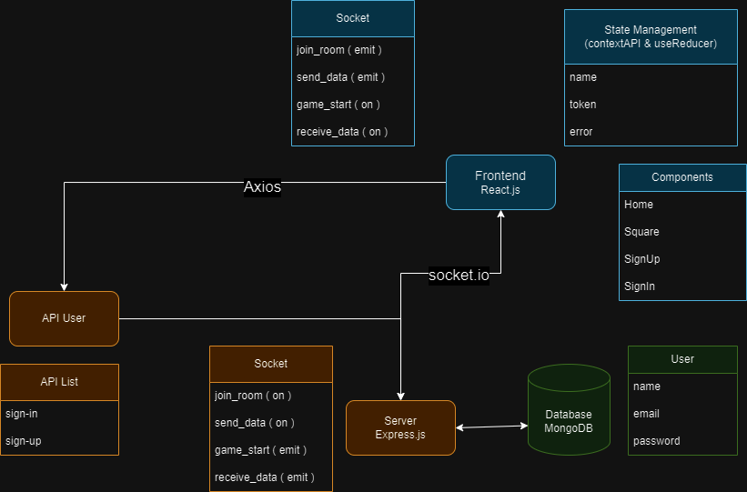

  

# Real-Time Multiplayer Tic Tac Toe Game

**Welcome to the world of fun real-time gaming with our Tic Tac Toe app!** This interactive full-stack MERN (MongoDB, Express, React, Node.js) and Socket.io application brings the timeless game of Tic Tac Toe to life like never before.

Tic Tac Toe, also known as "X and O" or "Noughts and Crosses," is one of the most beloved and timeless games. With our implementation, you can enjoy this age-old classic with friends, family, or fellow gamers, anytime and anywhere.

## Table of Contents

- [Features](#features)
- [Architecture](#architecture)

## Features

- 🚀 Real-time multiplayer gameplay.
- 👥 User authentication and player profiles.
- 🎨 Minimalist design
- 💻 Interactive and responsive UI.
- ⏳ **Player Turn Control:** Players are only allowed to make a move when it's their turn, ensuring a fair and engaging gaming experience.

## Architecture

  

The architecture of this Tic-Tac-Toe game and MERN stack application is designed to provide a real-time, interactive, and secure gaming experience to users, with separate client and server components working in harmony. The React frontend provides the user interface and interacts with the Node.js/Express.js backend, while Socket.IO facilitates real-time communication, making the game engaging and dynamic. Security, performance, and error handling are also essential considerations in building a robust application architecture.

### User Interface (Frontend)

- **React.js**: The frontend is built with React.js, which handles the presentation layer and user interaction.

- **Context API and useReducer**: State management within the React frontend is facilitated using the Context API and the useReducer hook, allowing for effective management of game states and user authentication.

- **Socket.IO Client**: The Socket.IO client is used to establish real-time connections to the server, enabling users to play the Tic-Tac-Toe game in real time and receive updates without refreshing the page.

- **Component Library**: React components are organized into a component library, including the game board, status display, and user interface elements.

### Application Logic (Backend)

- **Node.js**: The server-side logic is implemented with Node.js, providing a runtime environment for JavaScript on the server and enabling non-blocking I/O for handling multiple concurrent connections.

- **Express.js**: Express.js is used to create RESTful API endpoints and route HTTP requests from the frontend to the appropriate handlers.

- **Socket.IO (Server)**: Socket.IO is integrated within the Express.js backend to handle real-time communication between clients. It manages game events, such as player moves, and broadcasts updates to all connected clients.

- **Mongoose**: Mongoose is used as an Object-Data Modeling (ODM) library to interact with the MongoDB database. It provides a structured and efficient way to define schemas, perform queries, and handle data operations.

### Data Storage (Database)

- **MongoDB**: The MongoDB database is used to persist user information. We utilize Mongoose as the ODM (Object Data Modeling) library for streamlined database interactions.

### Communication and Real-Time Updates

- **Socket.IO**: Socket.IO enables real-time, bidirectional communication between the frontend and backend. It manages WebSocket connections and handles real-time game updates, player moves, and chat functionality.

### Security

- User authentication and authorization are implemented to ensure secure access to game features and data, often using JSON Web Tokens (JWT).

- Data validation and sanitization are implemented in backend layers to prevent security vulnerabilities.

### Error Handling and Logging

- Proper error handling and logging mechanisms are implemented to diagnose and address issues, improving the overall stability and user experience.
